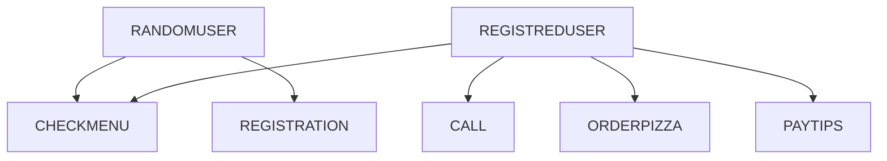
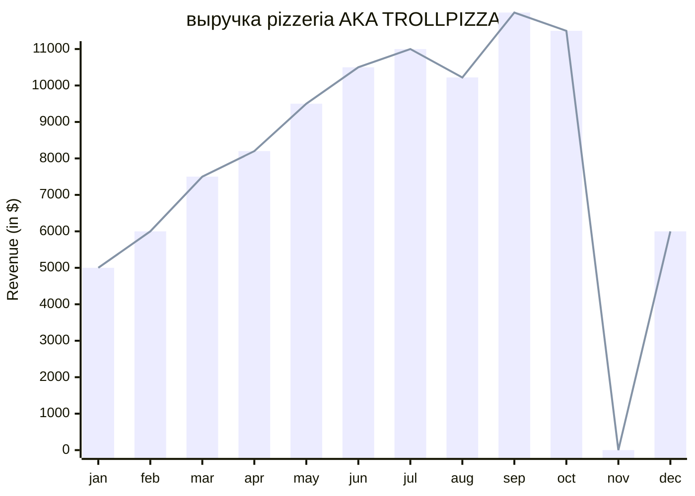
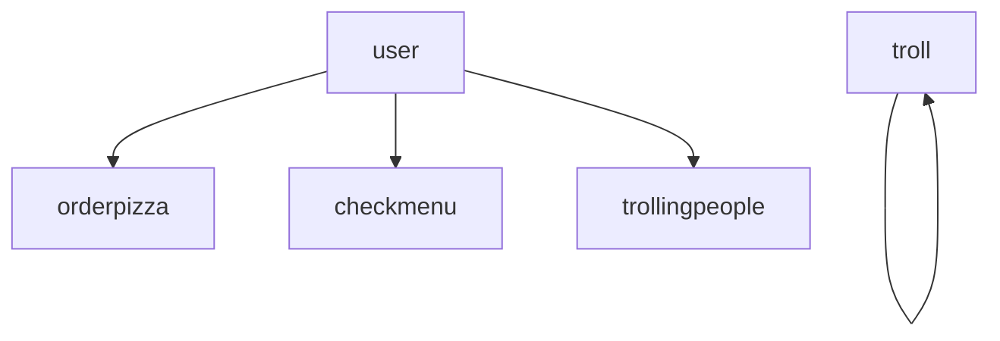

# mitroff
pizzeria AKA TROLLPIZZA
суть нашей пиццерии в том что все пиццы сделаны в виде тролльфейса и начинка всегда неизвестна покупателю
через приложение незарегистрированный человек может только сделать вещи такие как посмотреть меню и зарегестрироваться
зарегестрированный может ваще че хочет ну то есть заказать пиццу с рандомным вкусом сделать заказ оставить чаевые ну и все что клиент только захочет

на данной диаграмме я показал выручку в течении года ну это по нашим ожидаемым результатам

в нашей пиццерии есть пиццы
*   пицца без одного кусочка
*   кусочек без пиццы
*   пицца без начинки
*   с ананасами
конечно же все пиццы в виде головы тролля,так же за отдельную плату вы можете попросить затроллить любого чела в инете

